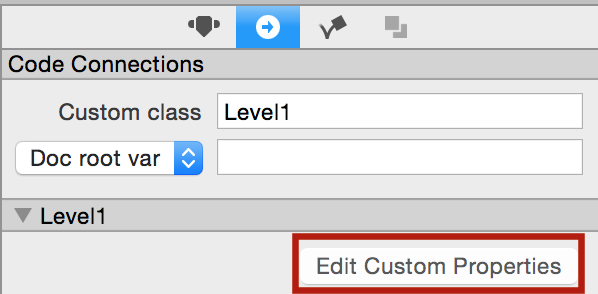
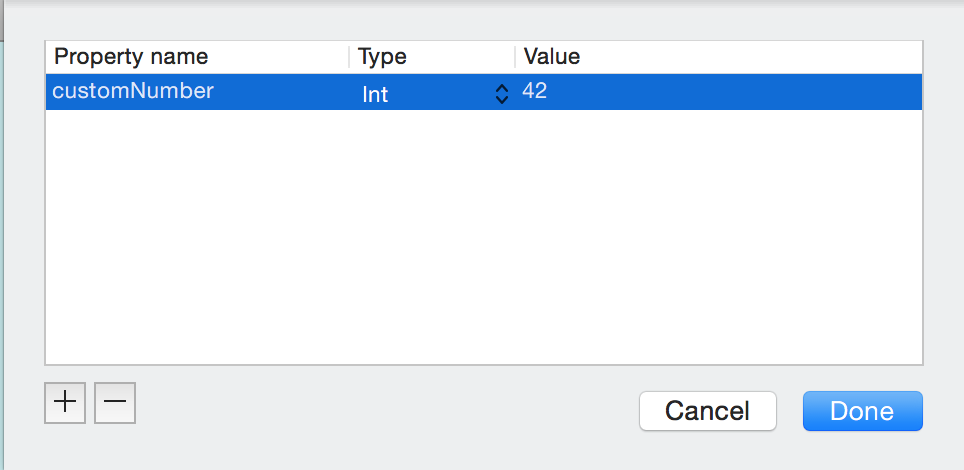
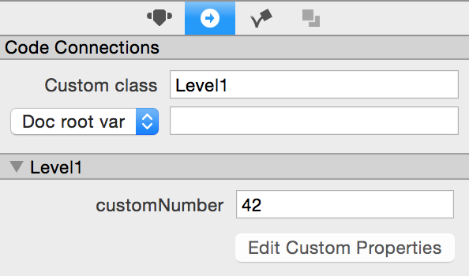

Planning out your game before starting is one of the most important things you can do. Starting with a good architecture will make your life easier as you develop and even moreso when you come back to update your game later on. We have set up this exercise to drill in the point that organizing your code and CCB files correctly is extremely important.

#Getting started

To get started, download the [Game Architecture assignment](https://github.com/MakeSchool/GameArchitecture-SpriteBuilder-Swift/archive/master.zip) and extract it's contents. In it, you will find a SpriteBuilder project containing a basic platformer game.

#Goal for this exercise
John Doe, a former employee of AmazingGames Inc. has been fired for having poor game architecture skills. It's your first day on the new job and you have to clean up behind John. The PM is asking you to:

- Replace the blue character with a green one
- Replace the flag with a different color
- Increase the running speed in level 2
- Decrease the running speed in level 3
- Reduce the jump height in all levels
- Add 5 collectible stars to each level, add a label to the screen that displays the amount of collected stars
- Make sure the game looks good on screens with different aspect ratios

You can find the **new** art assets in the `NewAssets` folder.

#Hints for this exercise

##Move game logic into a new Gameplay class, this should have its own scene CCB file

It doesn't make sense to have the code split between 3 different level classes. Each class is pretty much exactly the same so consolidate the code into a single Gameplay class. Take a look at Peeved Penguins if you need a reminder of how to load levels into a `Gameplay` scene.

##Make use of code connections with `Owner`

Use code connections with `Owner` insted of `Doc root var` to connect the character, next level button, etc to `Gameplay` class while keeping them contained in each Level's ccb. When you load in the level CCBs, use `CCBReader.load("CCBName" owner: self))`.

##Make use of custom properties in SpriteBuilder

Class custom properties allow you to load custom values into variables in the root class. Your level CCBs should make use of this!

> You first need to set up the custom properties via SpriteBuilder. Mimic the workflow below.
>
> 
>
> 
>
> 
>
> Now, in your `Level1` class, add `var customNumber: Int!`. When this class is loaded from a CCB file, the `customNumber` will be populated with a value of `42`.

You'll want to make a `Level` class that contains custom properties for things that vary with each level (level speed and next level name).